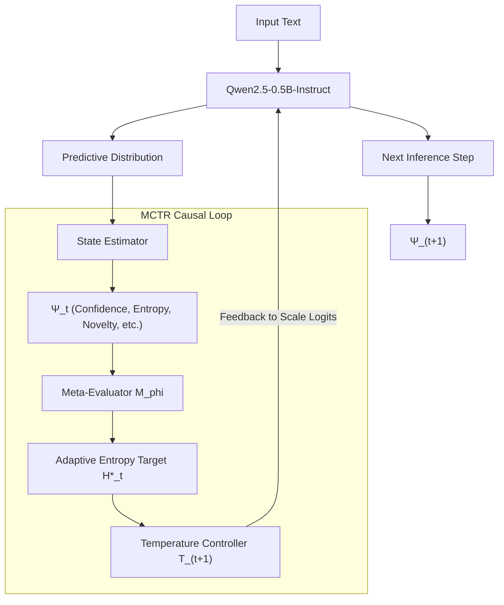

```mermaid
graph TD
    A["Input Text"] --> B["Qwen2.5-0.5B-Instruct"]
    B --> C["Predictive Distribution"]
    C --> D["State Estimator"]
    
    subgraph "MCTR Causal Loop"
        D --> E["Ψ_t (Confidence, Entropy, Novelty, etc.)"]
        E --> F["Meta-Evaluator M_phi"]
        F --> G["Adaptive Entropy Target H*_t"]
        G --> H["Temperature Controller T_(t+1)"]
    end
    
    H -- "Feedback to Scale Logits" --> B
    B --> I["Next Inference Step"]
    I --> J["Ψ_(t+1)"]
```
